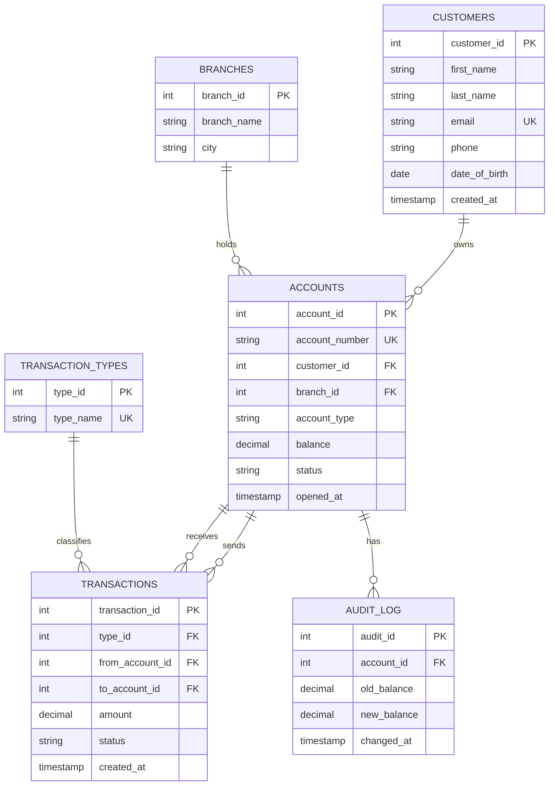

# SamyPay ER Diagram

```mermaid
erDiagram
    CUSTOMERS ||--o{ ACCOUNTS : owns
    BRANCHES ||--o{ ACCOUNTS : holds
    ACCOUNTS ||--o{ TRANSACTIONS : sends
    ACCOUNTS ||--o{ TRANSACTIONS : receives
    TRANSACTION_TYPES ||--o{ TRANSACTIONS : classifies
    ACCOUNTS ||--o{ AUDIT_LOG : has

    BRANCHES {
        int branch_id PK
        string branch_name
        string city
    }
    CUSTOMERS {
        int customer_id PK
        string first_name
        string last_name
        string email UK
        string phone
        date date_of_birth
        timestamp created_at
    }
    ACCOUNTS {
        int account_id PK
        string account_number UK
        int customer_id FK
        int branch_id FK
        string account_type
        decimal balance
        string status
        timestamp opened_at
    }
    TRANSACTION_TYPES {
        int type_id PK
        string type_name UK
    }
    TRANSACTIONS {
        int transaction_id PK
        int type_id FK
        int from_account_id FK
        int to_account_id FK
        decimal amount
        string status
        timestamp created_at
    }
    AUDIT_LOG {
        int audit_id PK
        int account_id FK
        decimal old_balance
        decimal new_balance
        timestamp changed_at
    }
```
